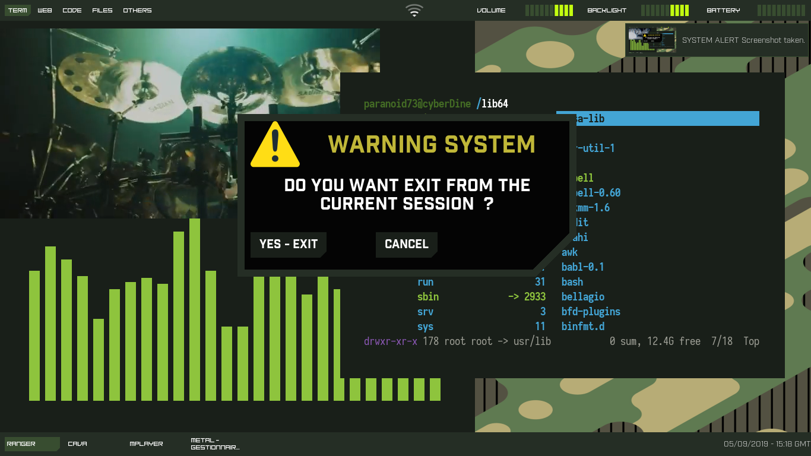

## Introduction  
my personal setup for [Awesome Wm](https://awesomewm.org/) , still needs improvement for it to be as advanced as possible and inspired by [worron config](https://github.com/worron/awesome-config).

## Requirements

**Browser**: Google Chrome , FireFox

  

**Terminal**: [urxvt](https://wiki.archlinux.fr/urxvt)

  

**File manager**: thunar , ranger

  

**Compositor**: compton

  
**Font**: Industry Black , Samsung Sans , Time Won

  
**Others**: notify-send , maim , nm-applet  , light-locker

## Installation

 

     git clone https://github.com/paranoid73/AwesomeWm-config.git ~/.config/awesome --recursive

  

## Screenshots

  

## wishlist

- [x]  exit screen

- [ ] customize notification

- [ ] titlebar

- [ ] customize tasklist  

## License
My awesome wm config is open-source , licensed under the [MIT license](https://opensource.org/licenses/MIT).

