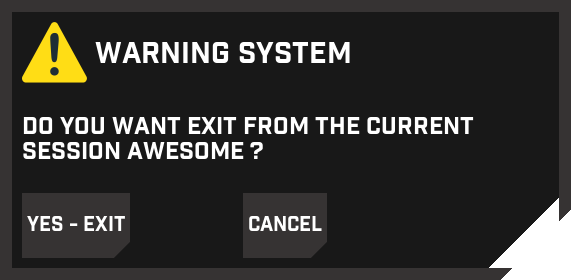

## Introduction

my personal setup for Awesome Wm, still needs improvement for it to be as advanced as possible.

## requirement
**WM**: [Awesome Wm](https://awesomewm.org/).

**Browser**: Google Chrome , FireFox

**Terminal**: [urxvt] (https://wiki.archlinux.fr/urxvt)

**File manager**: thunar

**Compositor**: compton

**Font**:  Industry-Light

## Screenshots
- wibar

- Exit Screen
