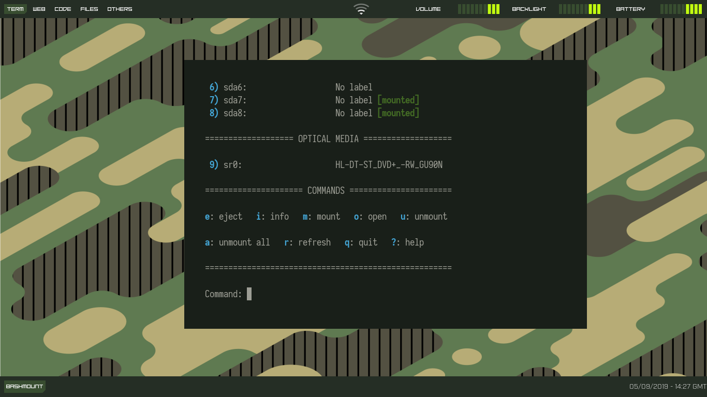
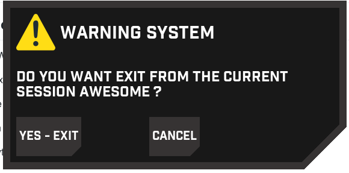

## Introduction

my personal setup for [Awesome Wm](https://awesomewm.org/) , still needs improvement for it to be as advanced as possible.

[](https://forthebadge.com)

## Requirements
**Browser**: Google Chrome , FireFox

**Terminal**: [urxvt](https://wiki.archlinux.fr/urxvt)

**File manager**: thunar

**Compositor**: compton

**Font**:  Industry Black , Samsung Sans

## Installation

```shell
$ git clone https://github.com/paranoid73/AwesomeWm-config.git ~/.config/awesome --recursive

## Screenshots
- wibar


- full screen


- exit screen



## wishlist
- [x] exit screen
- [ ] customize notification
- [ ] titlebar
- [ ] customize tasklist

## License

My awesome wm config is open-source , licensed under the [MIT license](https://opensource.org/licenses/MIT).
